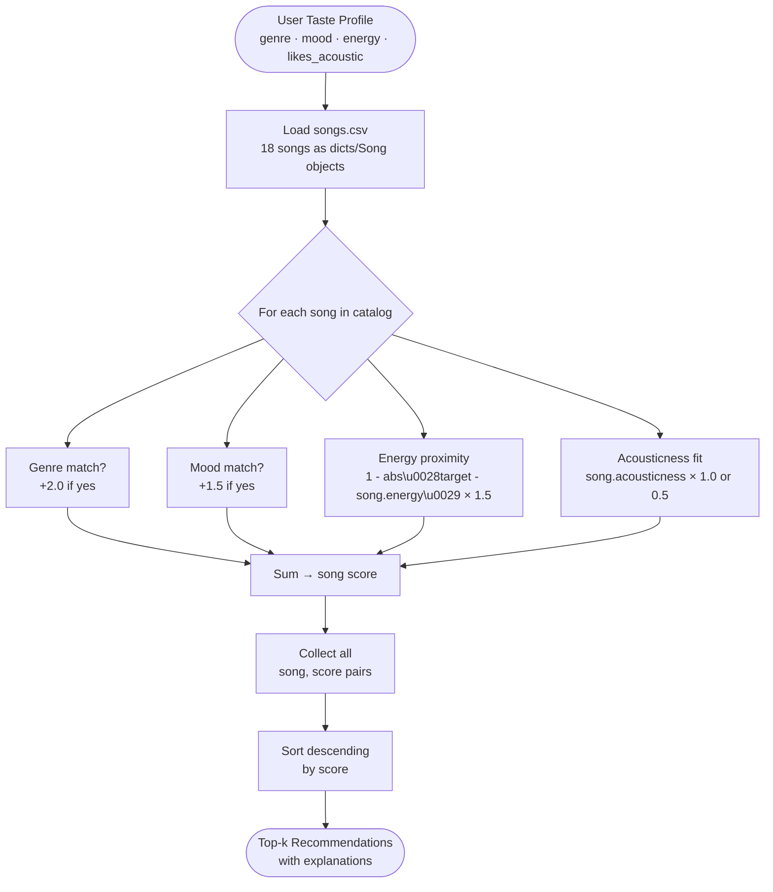

# 🎵 Music Recommender Simulation

## Project Summary

In this project you will build and explain a small music recommender system.

Your goal is to:

- Represent songs and a user "taste profile" as data
- Design a scoring rule that turns that data into recommendations
- Evaluate what your system gets right and wrong
- Reflect on how this mirrors real world AI recommenders

This project simulates a content-based music recommender. Given a user's taste profile (preferred genre, mood, energy level, and acoustic preference), the system scores every song in the 18-song catalog and returns the top matches. It mirrors the content-based filtering layer used in real platforms like Spotify — analyzing song attributes rather than other users' behavior.

---

## How The System Works

### How Real-World Recommenders Work

Real platforms like Spotify and YouTube combine two techniques. **Collaborative filtering** finds users whose listening history matches yours and surfaces songs they loved — it requires no knowledge of the audio itself, only behavior signals like likes, skips, and playlist adds. **Content-based filtering** builds a profile of the user's taste from song attributes (energy, mood, genre, tempo, acousticness, valence) and finds songs whose features closely match that profile. Most production systems blend both: collaborative filtering catches surprises ("people like you loved this unexpected track"), while content-based filtering ensures the core vibe is consistent. This simulator focuses entirely on content-based filtering, which is more transparent and easier to reason about.

### What This Version Prioritizes

This simulator prioritizes **vibe coherence** — getting the energy level and emotional mood right — over diversity or novelty. It uses a proximity-based scoring formula so that numerical features like energy reward closeness to the user's target, not just "higher is always better."

---

### Step 1 — Dataset

The catalog lives in `data/songs.csv` (18 songs). Each row contains:

| Feature | Type | Range | What It Captures |
|---------|------|-------|-----------------|
| `genre` | categorical | pop, lofi, rock, jazz, ambient, synthwave, indie pop, hip-hop, classical, r&b, country, metal, reggae, edm, folk | Fundamental sound palette |
| `mood` | categorical | happy, chill, intense, relaxed, focused, moody, confident, peaceful, romantic, nostalgic, angry, energetic, melancholic | Emotional context |
| `energy` | float 0–1 | 0.22 (classical) – 0.97 (metal) | Vibe intensity; the single most important axis |
| `valence` | float 0–1 | 0.22 – 0.84 | Positivity/happiness of the sound |
| `danceability` | float 0–1 | 0.28 – 0.95 | Rhythmic suitability for movement |
| `acousticness` | float 0–1 | 0.03 – 0.97 | Organic/acoustic vs produced/electronic texture |
| `tempo_bpm` | float | 60 – 168 | Pacing in beats per minute |

The 8 songs added in this phase (IDs 11–18) introduce genres and moods absent from the starter file: hip-hop, classical, r&b, country, metal, reggae, edm, and folk, with moods including confident, peaceful, romantic, nostalgic, angry, energetic, and melancholic.

---

### Step 2 — User Profile

A `UserProfile` defines what the recommender optimizes toward:

```python
UserProfile(
    favorite_genre = "lofi",      # the genre the user most wants to hear
    favorite_mood  = "chill",     # the emotional context they want right now
    target_energy  = 0.38,        # vibe intensity target (0 = silent room, 1 = mosh pit)
    likes_acoustic = True,        # True → reward organic/acoustic texture
)
```

**Why these fields differentiate user types:**
- A **"intense rock" user** would have `favorite_genre="rock"`, `target_energy=0.9`, `favorite_mood="intense"`, `likes_acoustic=False`. The system scores "Storm Runner" (energy=0.91, rock, intense) at ~5.4 and ranks it first.
- A **"chill lofi" user** (profile above) scores "Library Rain" (energy=0.35, lofi, chill) near the top and "Storm Runner" near the bottom — even though they share the energy-proximity formula. The genre and mood weights create clear separation.
- The profile is not too narrow: `target_energy` is a continuous value so the system gracefully degrades to "close enough" matches when an exact genre/mood isn't present.

---

### Step 3 — Algorithm Recipe (Scoring + Ranking)

#### Scoring Rule — computes a single number for one song

```
score = 0

if song.genre == user.favorite_genre:   score += 2.0   # genre match (highest weight)
if song.mood  == user.favorite_mood:    score += 1.5   # mood match

energy_proximity = 1 - |user.target_energy - song.energy|   # 0.0 – 1.0
score += energy_proximity × 1.5                              # rewards closeness, not just high/low

if user.likes_acoustic:
    score += song.acousticness × 1.0    # reward organic texture
else:
    score += (1 - song.acousticness) × 0.5   # mild preference for electronic sound
```

**Weight rationale:**
- Genre (+2.0) is highest because a wrong genre is a dealbreaker — a classical fan rarely wants metal even if the energy matches.
- Mood (+1.5) carries more weight than energy proximity because mood is a direct emotional intent label, whereas energy is a proxy.
- Energy proximity (×1.5) uses `1 - |diff|` so a user wanting `energy=0.35` gets rewarded for low-energy songs, not penalized.
- Acousticness (×1.0 / ×0.5) is secondary — it refines texture preference after the big filters have already run.

**Maximum possible score:** 2.0 + 1.5 + 1.5 + 1.0 = **6.0** (perfect match on all axes)

#### Ranking Rule — selects top-k from the whole catalog

```
Input:  user profile  +  all songs in CSV
Process: for each song → apply Scoring Rule → (song, score) pair
Sort:   descending by score
Output: top-k songs
```

You need *both* rules: the Scoring Rule answers "how good is this one song?"; the Ranking Rule answers "which songs should I actually serve?" by comparing every score against every other score.

---

### Step 4 — Data Flow Diagram



A single song travels: CSV row → parsed dict/Song object → four scoring checks → one total score → sorted list → recommended or filtered out.

---

### Step 5 — Expected Biases and Limitations

**Genre dominance:** Genre carries 2.0 points — the highest single weight. A song that perfectly matches energy and mood but has the wrong genre will lose to a same-genre song with average energy. This is intentional (genre is a real dealbreaker), but it means the system is conservative and won't surface cross-genre discoveries.

**Mood label rigidity:** Mood matching is binary — "chill" ≠ "relaxed" even though a listener might accept both. A real system would map these to a continuous emotion space (e.g., valence × arousal axes). This system could mis-rank songs that *feel* right but use a slightly different mood label.

**Energy-only numerics:** Only energy uses proximity scoring. Valence, danceability, and tempo_bpm are loaded but not yet scored — a highly positive song (valence=0.84) looks the same as a dark one (valence=0.22) to this system.

**Catalog bias:** The 18 songs were hand-authored, which means the genre and mood distribution reflects the curator's taste, not real listener diversity. A lofi fan gets 3 strong matches; a reggae fan gets only 1.

**No personalization over time:** The system has no memory — it doesn't learn from skips or replays. The same profile always returns the same ranked list, regardless of what the user has already heard.

---

## Getting Started

### Setup

1. Create a virtual environment (optional but recommended):

   ```bash
   python -m venv .venv
   source .venv/bin/activate      # Mac or Linux
   .venv\Scripts\activate         # Windows

2. Install dependencies

```bash
pip install -r requirements.txt
```

3. Run the app:

```bash
python -m src.main
```

### Running Tests

Run the starter tests with:

```bash
pytest
```

You can add more tests in `tests/test_recommender.py`.

---

## Experiments You Tried

Use this section to document the experiments you ran. For example:

- What happened when you changed the weight on genre from 2.0 to 0.5
- What happened when you added tempo or valence to the score
- How did your system behave for different types of users

---

## Limitations and Risks

Summarize some limitations of your recommender.

Examples:

- It only works on a tiny catalog
- It does not understand lyrics or language
- It might over favor one genre or mood

You will go deeper on this in your model card.

---

## Reflection

Read and complete `model_card.md`:

[**Model Card**](model_card.md)

Write 1 to 2 paragraphs here about what you learned:

- about how recommenders turn data into predictions
- about where bias or unfairness could show up in systems like this


---

## 7. `model_card_template.md`

Combines reflection and model card framing from the Module 3 guidance. :contentReference[oaicite:2]{index=2}  

```markdown
# 🎧 Model Card - Music Recommender Simulation

## 1. Model Name

Give your recommender a name, for example:

> VibeFinder 1.0

---

## 2. Intended Use

- What is this system trying to do
- Who is it for

Example:

> This model suggests 3 to 5 songs from a small catalog based on a user's preferred genre, mood, and energy level. It is for classroom exploration only, not for real users.

---

## 3. How It Works (Short Explanation)

Describe your scoring logic in plain language.

- What features of each song does it consider
- What information about the user does it use
- How does it turn those into a number

Try to avoid code in this section, treat it like an explanation to a non programmer.

---

## 4. Data

Describe your dataset.

- How many songs are in `data/songs.csv`
- Did you add or remove any songs
- What kinds of genres or moods are represented
- Whose taste does this data mostly reflect

---

## 5. Strengths

Where does your recommender work well

You can think about:
- Situations where the top results "felt right"
- Particular user profiles it served well
- Simplicity or transparency benefits

---

## 6. Limitations and Bias

Where does your recommender struggle

Some prompts:
- Does it ignore some genres or moods
- Does it treat all users as if they have the same taste shape
- Is it biased toward high energy or one genre by default
- How could this be unfair if used in a real product

---

## 7. Evaluation

How did you check your system

Examples:
- You tried multiple user profiles and wrote down whether the results matched your expectations
- You compared your simulation to what a real app like Spotify or YouTube tends to recommend
- You wrote tests for your scoring logic

You do not need a numeric metric, but if you used one, explain what it measures.

---

## 8. Future Work

If you had more time, how would you improve this recommender

Examples:

- Add support for multiple users and "group vibe" recommendations
- Balance diversity of songs instead of always picking the closest match
- Use more features, like tempo ranges or lyric themes

---

## 9. Personal Reflection

A few sentences about what you learned:

- What surprised you about how your system behaved
- How did building this change how you think about real music recommenders
- Where do you think human judgment still matters, even if the model seems "smart"

